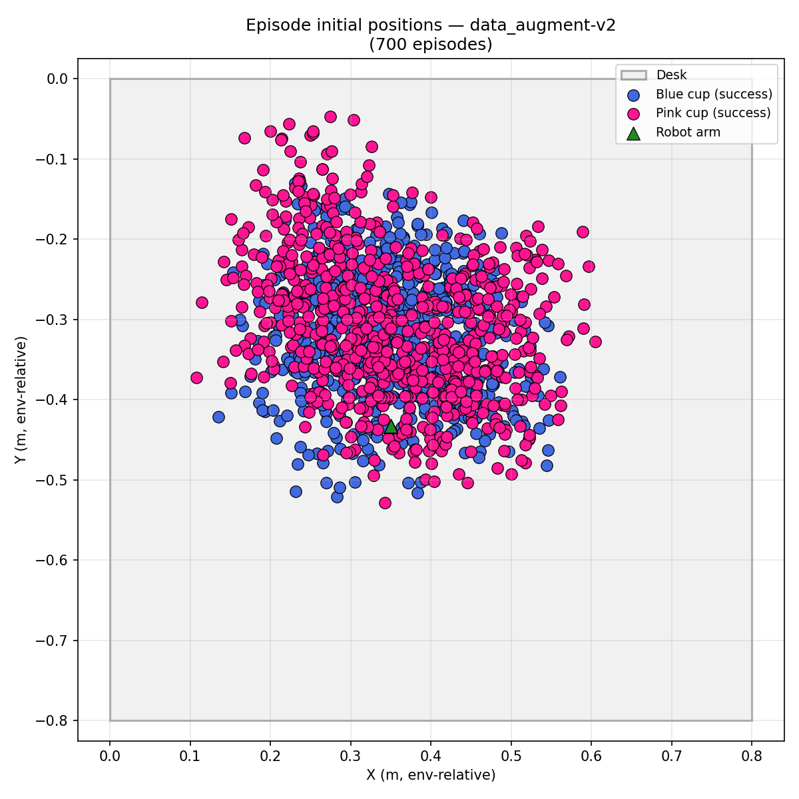
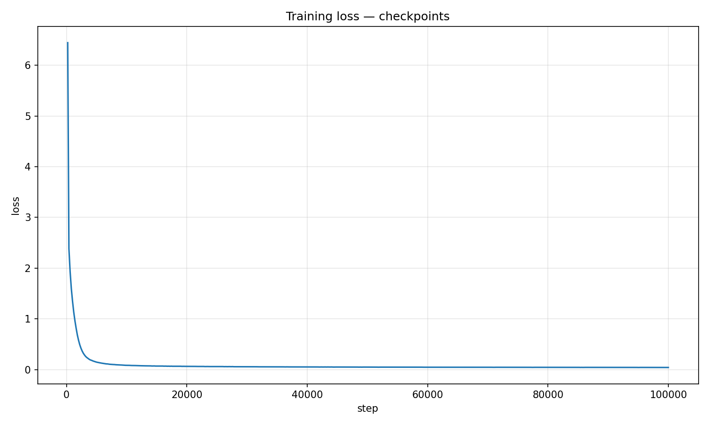

# AI Capstone: Cup Stacking Imitation Learning

This is the final project repository for the Embedded Systems Capstone course at NYCU. The system learns a robot manipulation policy from human demonstrations by combining UMI data collection, SLAM-based pose reconstruction, Isaac Lab synthetic data generation, and LeRobot policy training and rollout.

The implemented task is **cup stacking** in the kitchen scene: pick up the blue cup and stack it on top of the pink cup.

> **Platform:** Linux only. Simulation and training require an Nvidia GPU.

## Introduction

Our pipeline starts with real demonstrations recorded by UMI. The recordings are processed through the SLAM pipeline to estimate object poses and produce `object_poses.json`. Those poses are then used to initialize the Isaac Lab scene, where we generate successful simulated trajectories and convert them into a LeRobot dataset. Finally, we train an ACT policy and evaluate it in simulation.

The main technical ideas in this project are:

- Using SLAM to turn real demonstrations into reusable object pose annotations.
- Adding simulation-side stabilizers, including z constraints for more reliable grasping and placing.
- Increasing data diversity with object-position noise and action noise during augmentation.
- Training ACT in LeRobot and using temporal ensembling at inference time for smoother closed-loop control.

## Results

From the final dataset and rollout experiments described in our report:

- 70 real-world UMI demonstrations were recorded.
- The dataset contained 459 successful demonstrations, includes:
    - 57 episodes were obtained by replaying demonstrations in simulation with the finite-state-machine planner.
    - 403 additional episodes were generated through augmentation.
- The success rate on the public leaderboard reaches 73.3%, and 80% on the private leaderboard.

### Real-World UMI Demonstrations
We used the UMI device to record real-world cup-stacking demonstrations in the kitchen scene.

- Inputs per session: mapping video, gripper calibration video, and task demonstrations.
- Critical recording rule: keep both cups visible as much as possible to improve SLAM robustness and object pose estimation quality.
- Processing output: `object_poses.json`, which stores reconstructed per-episode object poses for simulation initialization.

Reference data from our team: [YinXuanLi/aicapstone_course_project](https://huggingface.co/YinXuanLi/aicapstone_course_project)


### Dataset Generation
After SLAM reconstruction, we replayed the demonstrations in Isaac Lab and only kept successful episodes in LeRobot format.

- Baseline replay: finite-state-machine planner with additional z-axis constraints to stabilize approach, grasp, lift, and place motions.
- Data augmentation: on top of reconstructed poses, we add controlled position and action noise to increase diversity.
- Reported settings: `aug_pos_noise=0.08`, `aug_action_noise=0.005`.

Final dataset composition:

- 57 successful episodes from UMI replay.
- 403 successful episodes from augmentation.
- 459 successful episodes in total.

This graph shows the distribution of the cups' initial positions:



Reference dataset from our team: [qiaoceng/AIC-data_augment-v2](https://huggingface.co/datasets/qiaoceng/AIC-data_augment-v2)

### Model Training
We trained an ACT policy in LeRobot using behavior cloning on the generated dataset.

- Backbone and policy family: ACT (Action Chunking with Transformers).
- Main setup: `batch_size=32`, `steps=100000`, checkpoint every `20000` steps.
- Inference improvement: temporal ensembling with `n_action_steps=1` improved local rollout stability compared with long open-loop chunk execution.

This is the training loss curves to illustrate the learning process:



Reference model from our team: [qiaoceng/AIC-act-v3-080000](https://huggingface.co/qiaoceng/AIC-act-v3-080000)


## Setup
If you want the older long-form execution notes, see [docs/README.md](docs/README.md).

### 1. Clone the repository

```bash
git clone git@github.com:qiaoceng/NYCU-2026-aicapstone-Final-Project.git
cd NYCU-2026-aicapstone-Final-Project
```

### 2. Install prerequisites

You will need `uv`, `git`, Docker, `exiftool`, and `ffmpeg`. For simulation and training, you also need a Linux machine with an Nvidia GPU and driver support.

Install Docker and the extra system packages if needed:

```bash
sudo apt-get update
sudo apt-get install -y ca-certificates curl
sudo install -m 0755 -d /etc/apt/keyrings
sudo curl -fsSL https://download.docker.com/linux/ubuntu/gpg -o /etc/apt/keyrings/docker.asc
sudo chmod a+r /etc/apt/keyrings/docker.asc
echo "deb [arch=$(dpkg --print-architecture) signed-by=/etc/apt/keyrings/docker.asc] https://download.docker.com/linux/ubuntu $(. /etc/os-release && echo "$VERSION_CODENAME") stable" | sudo tee /etc/apt/sources.list.d/docker.list > /dev/null
sudo apt-get update
sudo apt-get install -y docker-ce docker-ce-cli containerd.io docker-buildx-plugin docker-compose-plugin
sudo apt-get install -y libimage-exiftool-perl ffmpeg
```

Verify the installation:

```bash
docker --version
docker compose version
exiftool -ver
ffmpeg -version
```

### 3. Install the Python environment

For the UMI pipeline only:

```bash
uv sync --package umi
source .venv/bin/activate
```

For the full project, including simulation and training:

```bash
make submodules
uv sync
source .venv/bin/activate
```

### 4. Log in to Hugging Face

```bash
hf auth login --token <YOUR_HF_TOKEN>
export HF_USER=<your-huggingface-username>
```

## End-to-End Workflow

### Step 1: Record demonstrations

Record the mapping video, gripper calibration video, and cup-stacking demonstration videos with UMI. Place them under a session folder such as `data/YYYYMMDD-cupstacking/raw_videos/`.

### Step 2: Process the recordings

Run the verification pipeline first. Use the pipeline config that matches your GoPro calibration file:

```bash
uv run umi run-slam-pipeline umi_pipeline_configs/verify_pipeline_C6.yaml \
   --session-dir <demo_directory_name>
```

If verification succeeds, build the dataset and export object poses:

```bash
uv run umi run-slam-pipeline umi_pipeline_configs/build_dataset_C6.yaml \
   --session-dir <demo_directory_name> \
   --task kitchen
```

Upload the generated object poses to Hugging Face:

```bash
hf upload ${HF_USER}/<repo_id> data/<demo_directory_name>/demos/mapping/object_poses.json
```

### Step 3: Generate synthetic data in simulation

Launch the Isaac Lab container on your GPU machine:

```bash
make launch-isaaclab-glowsai-4090
```

Inside the container, download the UMI output and run data generation:

```bash
hf download ${HF_USER}/<repo_id> --local-dir data/<demo_directory_name>

python scripts/datagen/generate_aug_scatter.py \
   --task HCIS-CupStacking-SingleArm-v0 \
   --num_envs 1 \
   --device cuda \
   --enable_cameras \
   --record \
   --use_lerobot_recorder \
   --lerobot_dataset_repo_id ${HF_USER}/<repo_id> \
   --object_poses data/<demo_directory_name>/object_poses.json
   --aug_multiplier 10 \
   --aug_pos_noise 0.08 \
   --aug_action_noise 0.005
```

Upload the generated dataset:

```bash
hf upload ${HF_USER}/<repo_id> ~/.cache/huggingface/lerobot/${HF_USER}/<repo_id>/ --repo-type dataset
```

Build codebase tag

```bash
.venv/bin/python -c "
from huggingface_hub import HfApi
HfApi().create_tag('${HF_USER}/<repo_id>', tag='v3.0', repo_type='dataset')
print('tag v3.0 created')
"
```

(Optional) Build the distribution map of the cups' initial positions for every episodes (Related file: scripts/rollout_record_scatter.py)

```bash
python scripts/rollout_record_scatter.py \
   --json ~/.cache/huggingface/lerobot/${HF_USER}/<repo_id>/scatter_episodes_success.json \
   --annotate
```

### Step 4: Train a policy

Run training on the host machine, not inside Docker:

```bash
CUDA_VISIBLE_DEVICES=0 lerobot-train \
   --dataset.repo_id=${HF_USER}/<repo_id> \
   --dataset.image_transforms.enable=true \
   --policy.type=act \
   --output_dir=outputs/train/<output_dir> \
   --job_name=cupstacking \
   --policy.device=cuda \
   --wandb.enable=true \
   --policy.repo_id=${HF_USER}/<policy_repo_id> \
   --policy.chunk_size=50 \
   --policy.n_action_steps=50 \
   --batch_size=32 \
   --steps=100000 \
   --save_freq=20000
```

### Step 5: Evaluate in simulation

Download the trained policy and evaluate it inside the Isaac Lab container:

```bash
hf download ${HF_USER}/<policy_repo_id> --local-dir checkpoints/<policy_dir>

python scripts/rollout_record_platform.py \
   --task=eval/cup_stacking_eval.py \
   --policy_type=lerobot-act \
   --policy_checkpoint_path=checkpoints/<policy_dir> \
   --policy_action_horizon=1 \
   --device=cuda \
   --enable_cameras \
   --headless \
   --eval_rounds=50 \
   --episode_length_s=20
```
Note: `rollout_record_platform.py` can save the simulation videos and create a .json file to record the initial positions of the blue cups and the pink cups.

(Optional) Build the distribution map of the cups' initial positions.
```bash
python scripts/rollout_record_scatter.py \
   --json [Path to the json file] \
   --annotate
```